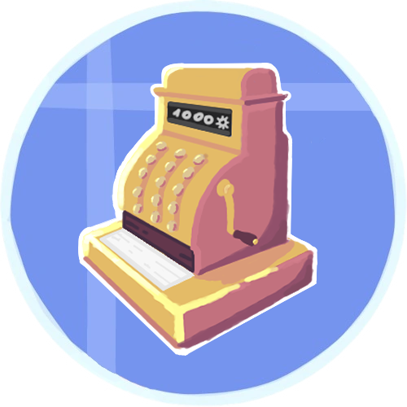

  
  <h1>Create Numismatics</h1>

  

## License
Create Numismatics is licensed under the LGPL license. See [LICENSE](LICENSE) for more information.

Certain sections of the code are from the Create mod, which is licensed under the MIT license. See [Create's license](https://github.com/Creators-of-Create/Create/blob/mc1.18/dev/LICENSE) for more information.

Most of the code for annotation based conditional mixins is based on Neruina's Conditional Mixins, which is licensed under the MIT license. See [Neruina's license](https://github.com/Bawnorton/Neruina/blob/multi-version/LICENSE.txt) for more information.